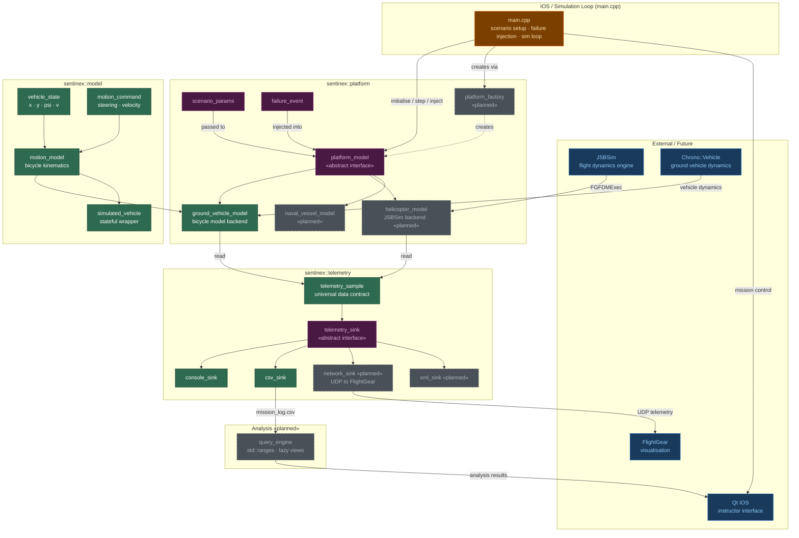

# SENTINEX Architecture



## Layer Summary

| Layer | Namespace | Status |
|---|---|---|
| Physics | `sentinex::model` | Done |
| Platform abstraction | `sentinex::platform` | Done (ground vehicle) |
| Telemetry pipeline | `sentinex::telemetry` | Done (console + CSV) |
| Analysis | — | Planned (query engine) |
| Visualisation | — | Planned (FlightGear) |
| IOS UI | — | Planned (Qt) |

## Data Flow

```
scenario_params
      │
      ▼
platform_model::initialise()
      │
      ▼  (each step)
platform_model::step(dt)
      │
      ▼
platform_model::read()
      │
      ▼
telemetry_sample
      │
      ├──▶ console_sink   →  terminal
      ├──▶ csv_sink       →  mission_log.csv  →  query_engine
      ├──▶ network_sink   →  FlightGear (UDP)
      └──▶ xml_sink       →  mission_log.xml
```
